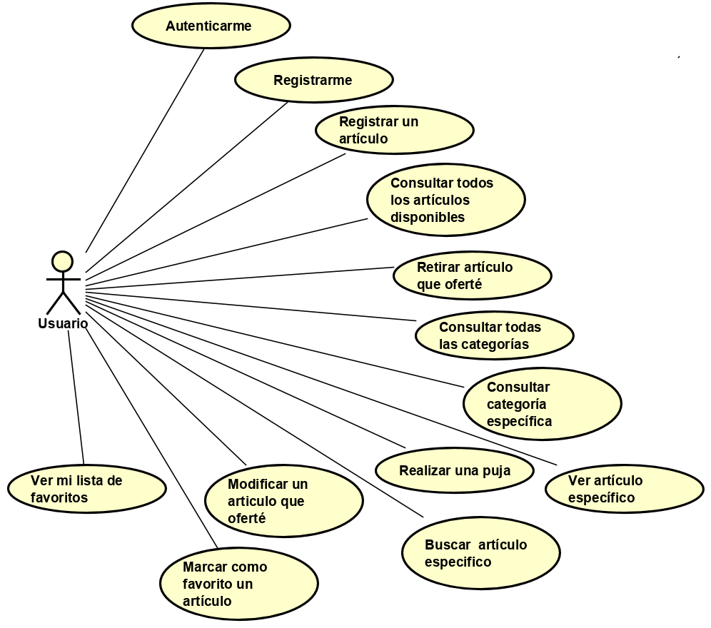
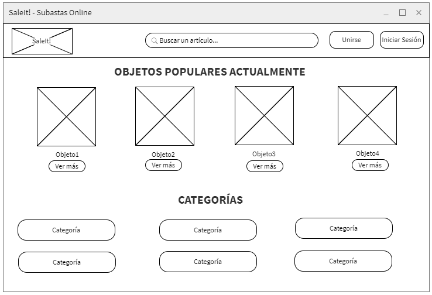
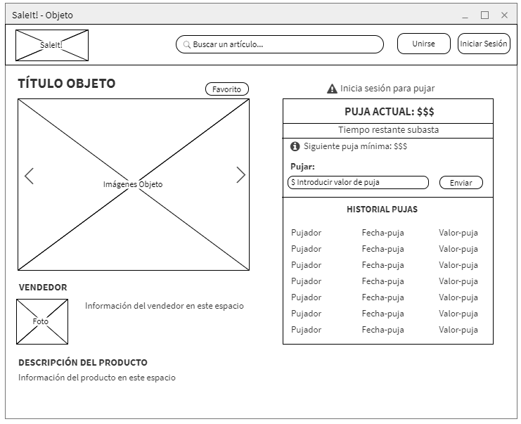
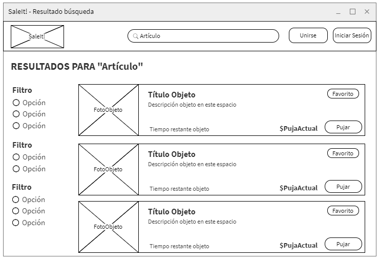
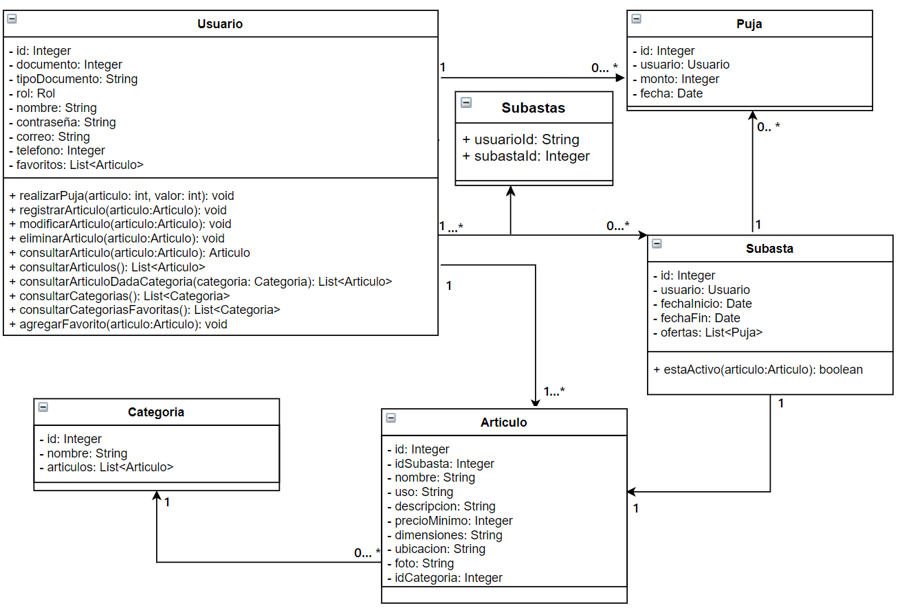
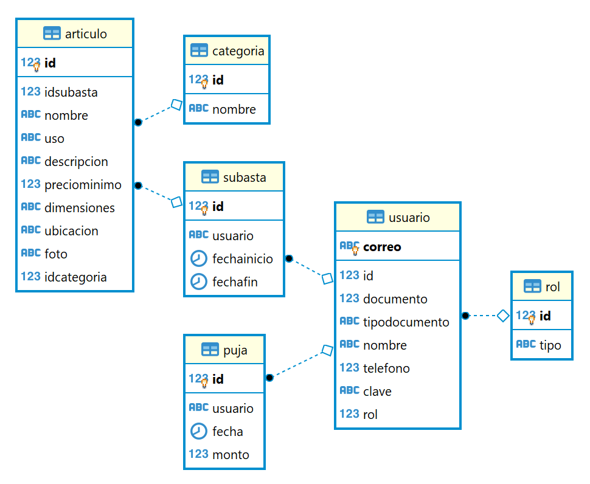

# _Sale It_

## _Integrantes_
*   _Juan Sebastián Frásica Galeano_
*   _Angie Daniela Ruiz Alfonso_
*   _Juan Sebastián Díaz Salamanca_
## _Descripción de la aplicación_
_SaleIt es una aplicación web realizada como proyecto para la materia **Arquitecturas de Software (ARSW)** de la Escuela Colombiana de Ingeniería Julio Garavito.
Es una aplicación para realizar subastas. Allí el usuario podrá ofertar artículos y pujar para conseguirlos._
## _Valores agregados y diferenciadores de la aplicación_
_La usabilidad y los temas relacionados con la Experiencia de Usuario (UX) son un factor diferenciador de SaleIt con respecto a la mayoría de páginas de subastas, además de la participación de forma aninima dentro de las subastas al momento de ofrecer una puja._
## _Despliegue en Heroku_

 ## _Calidad del código_

 ## _Integración continua_
 
# _Arquitectura y diseño detallado de la aplicación_
## _Diagrama de casos de uso_

## _Historias de usuario_

### _1.	COMO Usuario QUIERO Iniciar Sesión PARA PODER autenticarme ante el sistema satisfactoriamente._
 **_Criterios de aceptación:_**
* _Se debe poder iniciar y cerrar sesión._
*	_Se debe usar una fuente de datos básica para autenticar al usuario._

### _2.	COMO Usuario QUIERO Registrarme PARA PODER realizar las diferentes labores que me permita el sistema dependiendo del rol con el que esté registrado._
 **_Criterios de aceptación:_**
*   _Se deben añadir los nuevos usuarios a la fuente de datos básica._
*   _Es necesario que cada usuario tenga un nombre de usuario y correo únicos._
*   _Al finalizar el registro, el usuario deberá elegir 3 categorías de su preferencia para que luego se muestren productos relacionados a éstas._

### _3.	COMO Usuario QUIERO Registrar un artículo PARA PODER venderlo al mejor postor._
_Un artículo es todo aquel elemento que es ofrecido por un usuario a los demás usuarios de SaleIt._
 **_Criterios de aceptación:_**
* _La información básica de un artículo es:_
    * _Identificador interno._
    * _Nombre del artículo._
    * _Detalles del artículo. (Marca, peso, modelo, material)_
    * _Precio mínimo._
    * _Estado de uso. (nuevo o usado)_
    * _Dimensiones._
    * _Fotografía real del artículo._
    * _Ubicación del producto._
    * _Fecha de vencimiento de la subasta._
    
*   _El usuario vendedor debe proporcionar como mínimo el **nombre del artículo**, **foto del artículo**, **fecha de vencimiento**, **estado de uso**, **precio mínimo** y **ubicación** para poder registrarlo._
*   _Una vez el artículo es registrado debe aparecer disponible para ser pujado por los demás usuarios de SaleIt._
*   _No pueden existir identificadores internos iguales para los artículos._

### _4.	COMO Usuario QUIERO Retirar un artículo que tengo ofertado PARA PODER dar de baja su subasta._
_Cuando algún artículo ofrecido se quiere retirar, este se debe eliminar de su lista de articulos ofertados._
**_Criterios de aceptación:_**  
  * _Al darse de baja un artículo, este no debe estar disponible para ser pujado._

### _5. COMO Usuario QUIERO Consultar todos los artículos disponibles PARA PODER conocer todas las subastas actuales._
_Los usuarios del sistema necesitan poder visualizar de una forma sencilla y agradable todos los artículos disponibles._
**_Criterios de aceptación:_**
 * _Al momento de realizar la consulta, de deben mostrar todos lo artículos que se encuentran activos en ese momento._
 * _Deben existir filtros que me permitan realizar una búsqueda mejor direccionada. Por categoría, precio y ubicación._
 * _El usuario podrá ver las ofertas que se cierran pronto (En las próximas 24 horas)._

### _6. COMO Usuario QUIERO Consultar todas las categorías PARA PODER conocer cuales existen._
 * _Se debe mostrar todas las diferentes categorías para los productos existentes._
 * _Se debe mostrar las categorías más populares._
 * _Se debe mostrar las categorías "Para ti" (las preferidas del usuario)._

### _7. COMO Usuario QUIERO Consultar una categoría PARA PODER ver los artículos correspondientes a ésta._
 * _Se debe mostrar una lista de artículos disponibles correspondiente a la categoría seleccionada._

### _8. COMO Usuario QUIERO Ver un artículo en específico PARA PODER conocer los detalles de este._
_Al seleccionar un artículo se debe poder ver más información de el._
**_Criterios de aceptación:_**
* _Se debe mostrar:_
    * _Nombre del artículo._
    * _Foto del artículo._
    * _Tiempo restante de la subasta._
    * _Puja con mayor valor._
    * _Siguiente puja mínima._
    * _Ubicación del artículo._
    * _Una tabla con todas las pujas realizadas, indicando el id del pujador (para su anonimato), la fecha de la puja y el valor pujado._

### _9. COMO Usuario QUIERO Realizar una puja PARA PODER ofertar por un artículo_
_Una vez un usuario decide el artículo que desea obtener, puede proceder a hacer su puja respectiva._
**_Criterios de aceptación:_**
 * _El valor a pujar debe ser mayor o igual que la puja mínima._
 * _Si el usuario puja por un valor menor al mayor valor pujado, se le mostrará una sugerencia indicandole el minimo valor que debería pujar para ser aceptado._
 
 ### _10. COMO Usuario QUIERO Modificar un articulo que tengo ofertado PARA PODER realizar los cambios deseados sobre la información relacionada a este._
_Los usuarios del sistema necesitan poder modificar de una forma sencilla y agradable la información de sus articulos ofertados._
**_Criterios de aceptación:_**
* _Al momento de modificar el articulo, se debe poder modificar:_
    * _Nombre del artículo._
    * _Detalles del artículo. (Marca, peso, modelo, material)_
    * _Precio mínimo._
    * _Estado de uso. (nuevo o usado)_
    * _Dimensiones._
    * _Fotografía real del artículo._
    * _Ubicación del producto._
    * _Fecha de vencimiento de la subasta._
    
 * _El valor del identificador interno no es modificable por el usuario._

### _11. COMO Usuario QUIERO Buscar un artículo en especifico PARA PODER encontrar el artículo deseado._
**_Criterios de aceptación:_**
 * _Se podrá buscar un artículo por su nombre en una barra de búsqueda._
 * _La búsqueda del artículo se hará en todas las categorías._

### 12. COMO Usuario QUIERO Marcar como favorito un artículo PARA PODER añadirlo a mis favoritos._
**Criterios de aceptación:**
* _Al momento de consultar o buscar un artículo debe existir la opción para marcar como favorito._

### _13. COMO Usuario QUIERO Ver mi lista de favoritos PARA PODER consultar qué artículos me han gustado._
**_Criterios de aceptación:_**
 * _Se debe mostrar con claridad una lista de los artículos marcados como favoritos por el usuario._

## Mockups

 * _Página de inicio. (principal)_

 * _Página visualizando algún objeto._

 * _Página de resultados de una búsqueda._

## Diagrama de clases

## Diagrama E-R

## Diagrama de componentes

 
