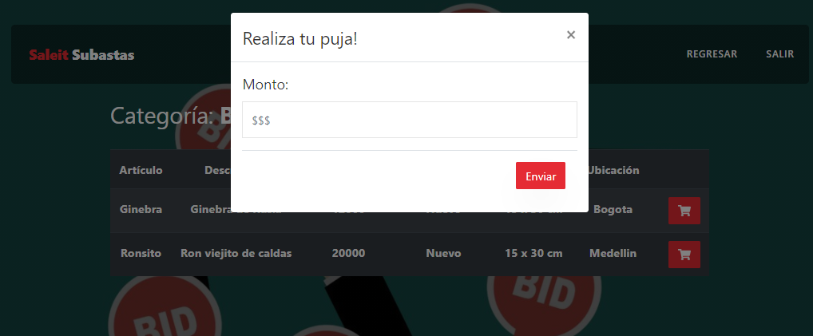
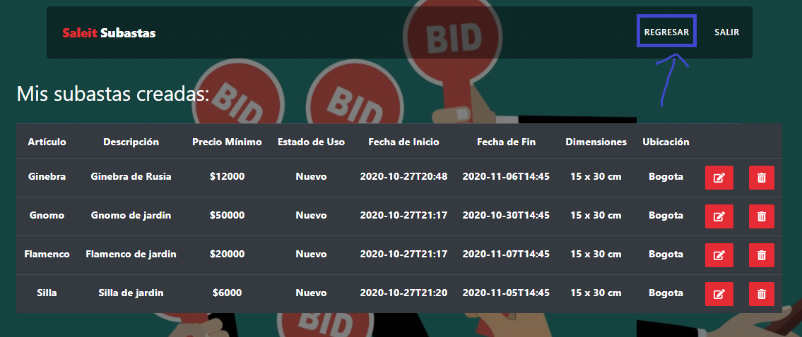

# Table of contents

* [Initial page](README.md)

# Requerimientos no funcionales

## 1. Usabilidad

Consideramos la usabilidad como un requerimiento no funcional, y para demostrarlo, nos basamos en algunas heurísticas que propone Jakob Nielsen para el diseño UI

* **Visibilidad:** 

* **Relación entre el sistema y el mundo real:**  

Nuestra aplicación utiliza un lenguaje muy claro muy claro y conciso para los usuarios que quieran ofertar algún artículo en alguna subasta, y también para aquellos que quieran realizar pujas/compras. 

Esto sigue las convenciones del mundo real, haciendo que la información aparezca en un orden natural y lógico.

Como se puede observar en la imagen anterior, se usan palabras como "Puja", las cuales hacen match con los usuarios que habitualmente realizan subastas.
 
* **Control y libertad del usuario:** 

Al momento de utilizar la aplicación, los usuarios tienen varios caminos para ir/acceder a alguna parte de la app.

Por ejemplo, para poder ver las categorías, el usuario puede hacer scroll con el mouse y bajar hasta las categorías, o también puede dar click en el menú principal en "Categorías" para poder dirigirse allí:

También, el usuario cuenta con el botón de "Regresar" para poder volver a la página donde se encontraba previamente:

* **Consistencia y estándares:**
Nuestra aplicación sigue y repite algunos patrones para no confundir a los usuarios.

Por ejemplo, al mostrar las categorías mostramos 3 filas de con 3 categorías en cada una:

Todas las imagenes son del mismo tamaño, y los botones tienen la misma gama de colores.

Al tener un diseño consistente, esto genera confianza con los usuarios.

## 2. Escalabilidad

