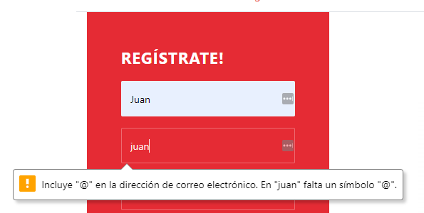
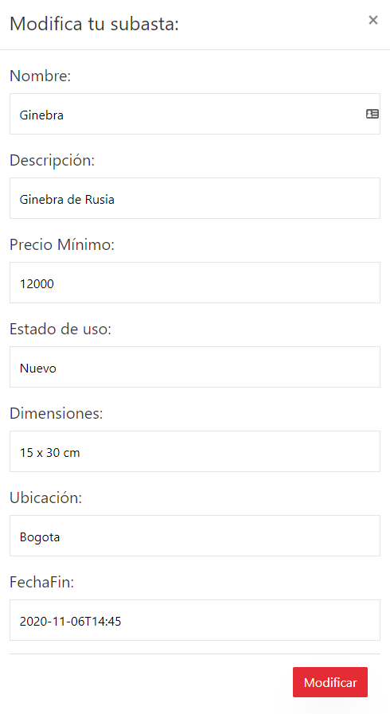
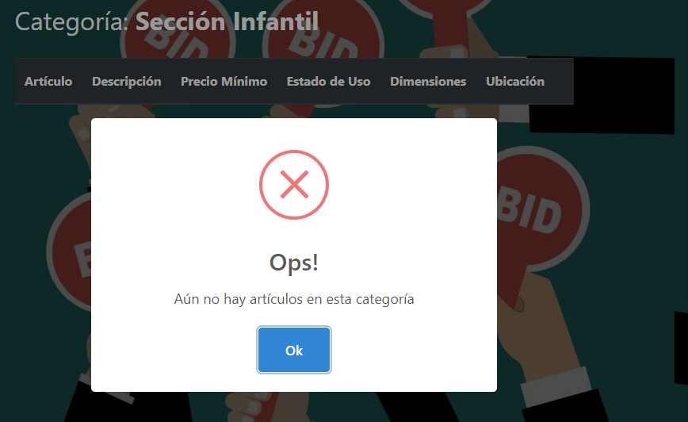
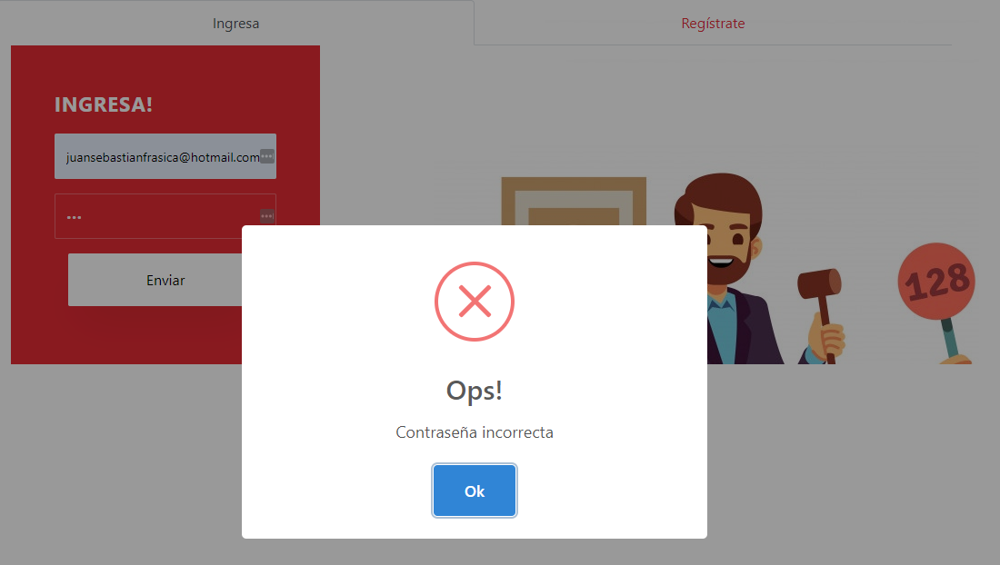
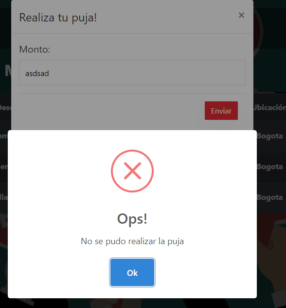

# Table of contents

* [Initial page](README.md)

# Requerimientos no funcionales

## 1. Usabilidad

Consideramos la usabilidad como un requerimiento no funcional, y para demostrarlo, nos basamos en algunas heurísticas que propone Jakob Nielsen para el diseño UI

* **Visibilidad:** 

Por ejemplo, al momento de pulsar "Ver artículos" de determinada categoría, antes de la tabla aparece el nombre de la categorías a la que el usuario dio click:

* **Relación entre el sistema y el mundo real:**  

Nuestra aplicación utiliza un lenguaje muy claro muy claro y conciso para los usuarios que quieran ofertar algún artículo en alguna subasta, y también para aquellos que quieran realizar pujas/compras. 

Esto sigue las convenciones del mundo real, haciendo que la información aparezca en un orden natural y lógico.

Como se puede observar en la imagen anterior, se usan palabras como "Puja", las cuales hacen match con los usuarios que habitualmente realizan subastas.
 
* **Control y libertad del usuario:** 

Al momento de utilizar la aplicación, los usuarios tienen varios caminos para ir/acceder a alguna parte de la app.

Por ejemplo, para poder ver las categorías, el usuario puede hacer scroll con el mouse y bajar hasta las categorías, o también puede dar click en el menú principal en "Categorías" para poder dirigirse allí:

También, el usuario cuenta con el botón de "Regresar" para poder volver a la página donde se encontraba previamente:

* **Consistencia y estándares:**
Nuestra aplicación sigue y repite algunos patrones para no confundir a los usuarios.

Por ejemplo, al mostrar las categorías mostramos 3 filas de con 3 categorías en cada una:

Todas las imagenes son del mismo tamaño, y los botones tienen la misma gama de colores.

Al tener un diseño consistente, esto genera confianza con los usuarios.

* **Prevención de errores:**
Es mejor prevenir los errores que generar mensajes una vez se produzcan.

Por ejemplo, en nuestra aplicación se previenen los errores al momento de crear una cuenta.

Primero, se informa que la contraseña a ingresar debe ser de mínimo 6 caracteres:

También, se informa que cuando se escriba el correo se deba escribir un '@':

* **Reconocimiento antes que recuerdo:**

Hay que intentar en la medida de lo posible mostrar objetos, acciones y opciones para minimizar el uso de memoria del usuario.

Un ejemplo, en Sale-It al momento de que un vendedor quiere editar una subasta, en el formulario de edición aparecen los datos que el usuario previamente digitó, para que solamente tenga que editar lo necesario:

* **Flexibilidad y eficiencia de uso:**
La presencia de atajos, que no son vistos por los usuarios novatos, pueden ofrecer una interacción más rápida a los usuarios avanzados. Esta interacción es más eficaz que la que el sistema puede proveer a los usuarios de todo tipo. Se debe permitir que los usuarios adapten el sistema para usos frecuentes. Como por ejemplo los atajos del teclado mediante combinación de teclas.

En Sale-It funcionan los típicos atajos de Crl+C y Crl+V para copiar y pegar respectivamente en cualquiera de los formularios

También funciona el Crl+Z para deshacer y traer vuelta información

* **Estética y diseño minimalista:**
El contenido de la app está simplificado para que el usuario sólo se fije en lo realmente importante.

La aplicación cuenta con un diseño claro y minimalista de lo que corresponde a cada sección o función.

* **Ayudar a los usuarios a reconocer, diagnosticar y recuperarse de los errores:**
Cuando ocurren errores, se le informa al usuario de forma amigable, ya que todos los errores y excepciones han sido controlados.

Algunos ejemplos:

*   Cuando no hay artículos en cierta categoría:

*   Cuando un usuario digita mal su contraseña:

*   Cuando se envían datos inválidos al realizar la puja:

* **Ayuda y documentación:**
Contamos con un Manual de Uso de la aplicación, el cuál está disponible en el siguiente 

## 2. Escalabilidad

